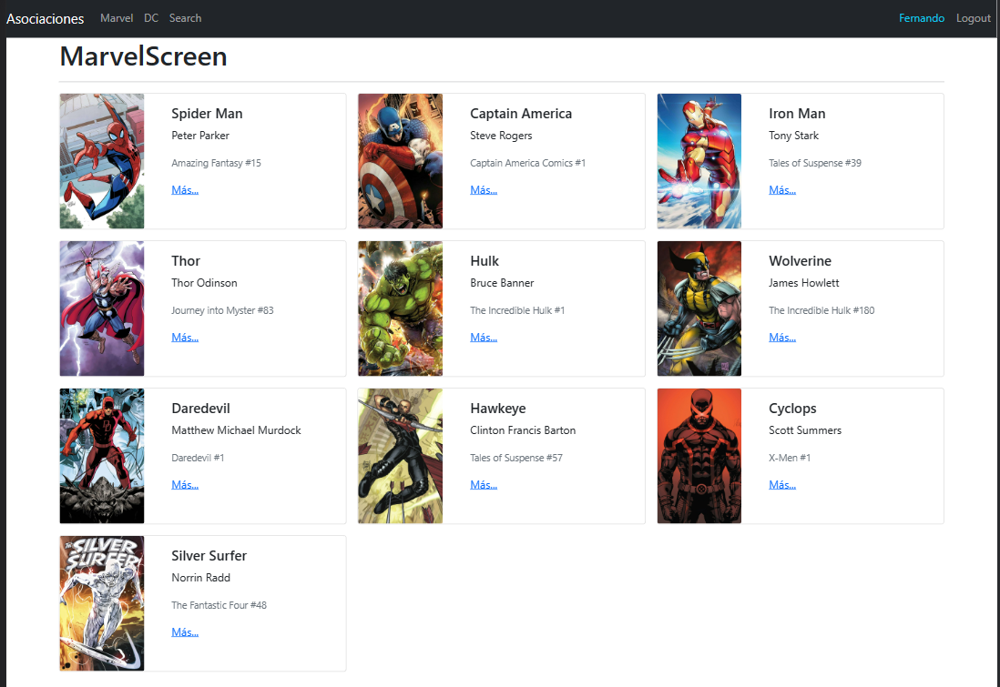

# SPA con manejo de context reducer y react-router-dom v6

Este es un proyecto básico para dominar manejo de rutas privadas y públicas usando reducer para el manejo del estado global

Node 16.17.0

## Tabla de contenido

- SPA ( Single Page Application ) a profundidad

- Diferentes temas en la misma aplicación aplicados a diferentes rutas

- Múltiples Routers

- Push y Replace en el History

- Rutas públicas

- Rutas privadas

- Login y logout - Sin backend aún

- Recordar cuál fue la última ruta visitada para mejorar la experiencia de usuario.

- Context

- Reducer

## Vista previa



## Despliegue en GitHub Pages

Sigue estos pasos para desplegar el proyecto en GitHub Pages:

1. **Instalar gh-pages**:

   ```bash
   npm install gh-pages --save-dev
   ```

2. **Agregar scripts en `package.json`**:

   ```json
   "scripts": {
     "predeploy": "npm run build",
     "deploy": "gh-pages -d build"
   }
   ```

3. **Configurar la propiedad `homepage` en `package.json`**:

   ```json
   "homepage": "https://{tu-usuario}.github.io/{nombre-del-repositorio}"
   ```

4. **Crear un archivo `.env` en la raíz del proyecto con el siguiente contenido**:

   ```env
   PUBLIC_URL=/
   ```

5. **Construir y desplegar la aplicación**:

   ```bash
   npm run deploy
   ```

6. **Configurar GitHub Pages**:
   - Ve a la configuración del repositorio en GitHub.
   - En la sección "Pages", selecciona la rama `gh-pages` como fuente.

Tu aplicación debería estar disponible en `https://{tu-usuario}.github.io/{nombre-del-repositorio}`.
